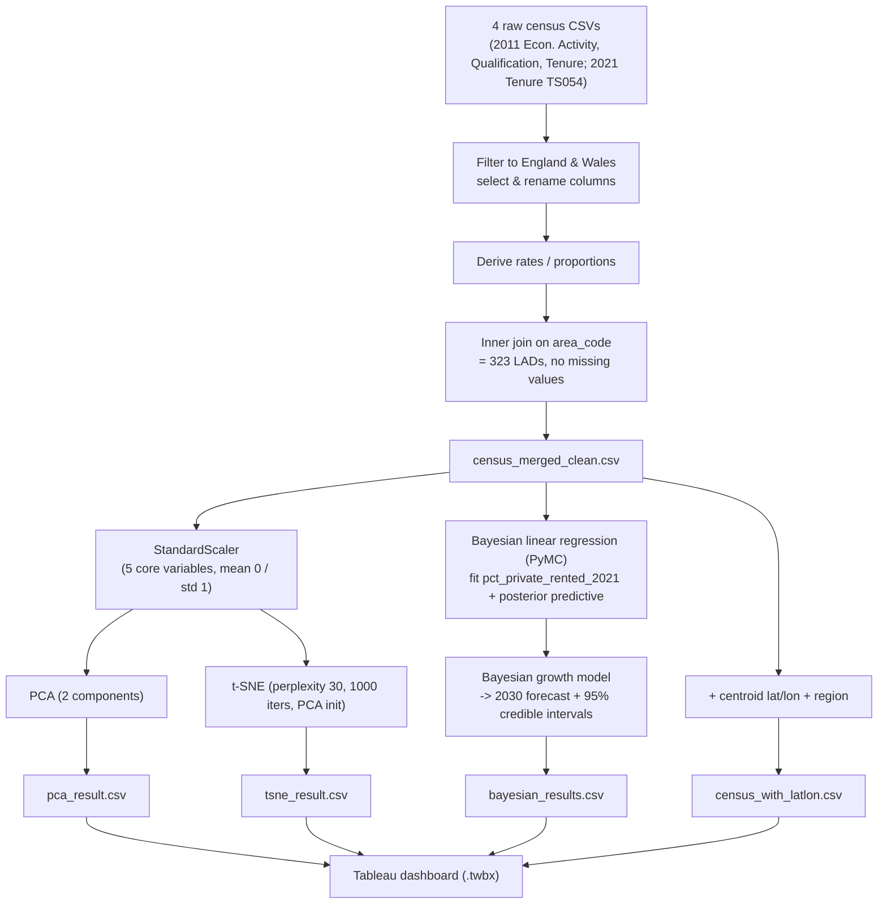

# Private Renting, Qualifications & Employment in England and Wales (2011–2021)

A visual-analytics study of how educational attainment, economic activity and housing tenure
interact across **323 Local Authority Districts (LADs)** in England and Wales, using the 2011
and 2021 Censuses. The project combines an interactive **Tableau** dashboard with a Python
analysis pipeline: **PCA** and **t-SNE** projections plus **Bayesian linear regression** with a
forecast of private-renting rates to **2030** and 95% credible intervals.

> MSc Data Science coursework — University of Bristol, *EMATM0066 Visual Analytics*
> ("Exploring Socio-Economic Trends in England and Wales: A Visual Analytics Approach").

---

## Contents

- [Overview](#overview)
- [Research question and hypothesis](#research-question-and-hypothesis)
- [Key findings](#key-findings)
- [The dashboard](#the-dashboard)
- [Data](#data)
- [Method and pipeline](#method-and-pipeline)
- [Repository structure](#repository-structure)
- [Reproducing the analysis](#reproducing-the-analysis)
- [Tech stack](#tech-stack)
- [Limitations and future work](#limitations-and-future-work)
- [References](#references)
- [Author](#author)
- [Licence and data attribution](#licence-and-data-attribution)

---

## Overview

After the 2008 financial crisis the private rented sector (PRS) in England and Wales roughly
doubled its share of housing, a shift often labelled *"Generation Rent"*. That growth is not
evenly spread: it concentrates in areas with many graduate workers, above all London. This
project treats **qualification level** as the organising variable and asks whether it predicts
both **unemployment** and **private renting**, and whether the most highly qualified areas saw
the largest tenure shifts over the decade.

Four census tables are cleaned and merged into one analysis-ready table of 323 LADs, explored
through:

| Layer | Purpose |
|---|---|
| **Choropleth maps, scatter plots, ranked bar charts** (Tableau) | Spatial patterns, pairwise relationships and direct LAD-to-LAD comparison for a non-specialist audience |
| **PCA + t-SNE projections** (Python → CSV → Tableau) | Reveal multivariate structure, clusters and outliers across the five core variables |
| **Bayesian linear regression** (PyMC) | Fit `pct_private_rented_2021`, quantify uncertainty, and forecast to 2030 with credible intervals |

The analytic tasks are framed with **Munzner's task taxonomy** — *Discover* and *Present* at the
high level; *Compare*, *Lookup*, *Browse* and *Summarise* at the mid level — and the dashboard
is assessed with Munzner's four-level validation model via a cognitive walkthrough.

---

## Research question and hypothesis

**Hypothesis.** Qualification level is a strong predictor of both employment status and housing
tenure in 2011, and LADs with a higher share of Level 4+ qualifications show a greater shift
toward private renting by 2021.

**Five core variables** (all proportions, ratio-scale, bounded 0–1, one row per LAD):

| Variable | Definition |
|---|---|
| `pct_level4` | Residents aged 16+ with Level 4 qualifications and above (degree level or equivalent) |
| `pct_no_quals` | Residents aged 16+ with no formal qualifications |
| `unemployment_rate` | Unemployed ÷ all usual residents aged 16–74 |
| `pct_private_rented_2011` | Private-rented households ÷ all households (2011) |
| `pct_private_rented_2021` | Private-rented households ÷ all households (2021) |

---

## Key findings

- **Qualifications and private renting move together.** Across all 323 LADs, `pct_level4` and
  `pct_private_rented_2021` show a positive correlation of **r = 0.41** — the central hypothesis
  holds.
- **Qualifications and unemployment move apart.** `pct_level4` vs `unemployment_rate`:
  **r = −0.39**. `pct_level4` vs `pct_no_quals`: **r = −0.90**, reflecting sharply polarised
  educational outcomes.
- **London dominates the top of the distribution.** City of London (68.4% Level 4+),
  Wandsworth (53.6%) and Kensington and Chelsea (52.7%) lead on attainment, and all three sit
  well above the national mean on private renting.
- **The tenure shift is near-universal.** **322 of 323 LADs** saw private renting rise between
  2011 and 2021. The national mean went from **15.8% → 19.3%** (+3.5 pp). The City of London
  had the single largest rise, **35.9% → 48.3%** (+12.4 pp).
- **2030 forecast.** Bayesian projection puts the national mean private-renting rate at about
  **22.8% by 2030**. High-qualification London LADs approach 50%; the City of London is
  forecast at **51.8%** (95% CI 48.9%–54.7%).
- **Structure in projection space.** PCA shows a gradient from low-qualification,
  high-unemployment LADs in Wales and the North East to high-qualification, high-renting London
  boroughs. t-SNE separates a tight London cluster, a diffuse English provincial cloud and a
  loose Welsh cluster with distinctively high no-qualifications rates. The **City of London** and
  the **Isles of Scilly** appear as outliers in both projections.
- **Model validity.** Mean Bayesian residual ≈ 0 (residual SD 0.017); **91.3%** of LADs'
  observed 2021 values fell inside the model's 95% credible interval — close to nominal
  coverage, i.e. only slightly overconfident.

See [`EMATM0066-VISA-mz25197.pdf`](EMATM0066-VISA-mz25197.pdf) for the full write-up, task
definitions, visualisation justification and evaluation.

---

## The dashboard

**File:** `EMATM0066-Visual Analytics-mz25197/Visual Analytics Coursework_mz25197.twbx`
(a packaged Tableau workbook — data is embedded, no external connection needed).

**Open it with** [Tableau Desktop](https://www.tableau.com/products/desktop) or the free
[Tableau Reader](https://www.tableau.com/products/reader).

Views in the workbook:

| View | Encoding |
|---|---|
| **Choropleth maps** | `pct_level4` and `pct_private_rented_2021` by LAD; sequential light-to-dark hue. A sequential (not diverging) scheme is used for the 2011→2021 change because 322/323 LADs increased. Custom geocoding from ONS LAD boundaries. |
| **Scatter + trend lines** | `pct_level4` vs `pct_private_rented_2021`, one mark per LAD, mark size = number of households, linear trend line with 95% CI band. Tooltip gives the full LAD name and all values (*Lookup*). |
| **Ranked / dual-axis bar charts** | LADs ranked by percentage-point change in private renting; dual-axis bars show 2011 vs 2021 side by side for the top and bottom LADs by qualification level. |
| **PCA scatter** | PC1 vs PC2, colour = `pct_level4`, tooltip = area name. |
| **t-SNE scatter** | tSNE_1 vs tSNE_2, colour = `pct_level4`, size = `unemployment_rate`, tooltip = area name + all five variables. |
| **Bayesian forecast plot** | Ranked point plot of predicted private renting with 95% credible-interval error bars, surfacing both the highest predicted values and the highest forecast uncertainty. |

---

## Data

All inputs are ONS Census data for England and Wales, downloaded from
[NOMIS](https://www.nomisweb.co.uk/) and the
[ONS 2021 bulk portal](https://www.nomisweb.co.uk/sources/census_2021_bulk).

### Sources

| File (`Dataset/`) | Census | Table | Used for |
|---|---|---|---|
| `Economic Activity.csv` | 2011 | Economic Activity (QS601EW) | `unemployment_rate` |
| `Highest Level of Qualification.csv` | 2011 | Highest Level of Qualification (QS501EW) | `pct_level4`, `pct_no_quals` |
| `Tenure.csv` | 2011 | Tenure (QS405EW) | `pct_private_rented_2011` |
| `Tenure 2021.csv` | 2021 | Tenure (TS054), LAD level | `pct_private_rented_2021` |
| `census2021-ts054-{ctry,rgn,utla,msoa,lsoa,oa}.csv` | 2021 | TS054 at other geographies | Raw ONS bulk download (context / cross-checking); only the LAD slice feeds the pipeline. `oa` is ~11 MB. |
| `metadata/ts054-2021-2.txt` | 2021 | TS054 dataset metadata | Provenance, licence, ONS contact |

`EMATM0066-Visual Analytics-mz25197/Local_Authority_District_(December_2018)_to_NUTS3_to_NUTS2_to_NUTS1_(January_2018)_Lookup_in_United_Kingdom.csv`
is an ONS LAD ↔ NUTS region lookup, used to attach region labels for the map and grouped views.

### Geographic harmonisation

LAD boundaries changed between 2011 and 2021 (for example, mergers in Somerset and
Northamptonshire). LADs were matched across the two years with the ONS **"Change Over Time"**
lookup; heavily restructured LADs were combined by population-weighted aggregation or excluded
so the two years stay comparable. The 2021 Tenure table covers England and Wales only, so all
2011 tables are filtered to `geography code` starting with `E` or `W`. The result is **323 LADs
present in every table**, joined with an inner join on `area_code`, with **no missing values**
in the merged table.

### Derived variables

```text
unemployment_rate        = unemployed              / total_residents_16_74
pct_private_rented_2011   = private_rented_2011     / total_households_2011
pct_private_rented_2021   = private_rented_2021     / total_households_2021
pct_level4                = level4_and_above        / total_usual_residents
pct_no_quals              = no_qualifications       / total_usual_residents
```

---

## Method and pipeline



### 1. Preprocessing — `VISA DataPreprocessing Script.py`

`pandas` reads each raw table, keeps only the columns needed, renames them, filters to England
and Wales, computes the derived rates above, and inner-joins the four tables on `area_code`.
Output: **`census_merged_clean.csv`** (323 rows).

*(The script was developed in Google Colab; the `pd.read_csv` paths point at
`/content/drive/...` and need repointing to `Dataset/` for a local run — see
[Reproducing the analysis](#reproducing-the-analysis).)*

### 2. Dimensionality reduction

The five core variables are standardised with `StandardScaler` (mean 0, standard deviation 1),
then:

- **PCA** — `sklearn.decomposition.PCA(n_components=2, random_state=42)`. Component **loadings**
  and variance explained are printed to the console; PCA is used first because its axes are
  interpretable linear combinations of the originals. Exported to **`pca_result.csv`**.
- **t-SNE** — `sklearn.manifold.TSNE(n_components=2, perplexity=30, n_iter=1000,
  learning_rate="auto", init="pca", random_state=42)`, on the same standardised inputs. Exported
  to **`tsne_result.csv`**. PCA gives the global structure; t-SNE surfaces local clusters.

### 3. Bayesian modelling — PyMC

**Fit model** (explain 2021 tenure). Predictors (standardised):
`pct_private_rented_2011`, `unemployment_rate`, `pct_level4`, `pct_no_quals`.
Target: `pct_private_rented_2021`.

```text
alpha ~ Normal(mu = mean(y), sigma = 0.05)
beta  ~ Normal(0, 0.1)          # one per predictor
sigma ~ HalfNormal(0.05)
y     ~ Normal(alpha + X · beta, sigma)
sampler: pm.sample(2000 draws, tune=1000, target_accept=0.9, random_seed=42)
```

A posterior predictive pass gives each LAD a fitted 2021 mean, a 95% interval and a residual.

**Forecast model** (project to 2030). Observed per-LAD growth `2021 − 2011` is modelled as
`growth ~ Normal(mu_growth, sigma_growth)` with `mu_growth ~ Normal(0.03, 0.02)` and
`sigma_growth ~ HalfNormal(0.02)`. Sampled `growth_2030` values are added to each LAD's 2021
rate to give `pct_private_rented_2030_{mean,lower,upper}`.

All per-LAD results (observed, fitted 2021, residual, forecast 2030 with 95% intervals) are
written to **`bayesian_results.csv`**.

### 4. Validation

- **Residuals:** mean ≈ 0 (no systematic bias), SD = 0.017; largest residual is the City of
  London, consistent with it being a structural outlier.
- **Calibration:** 91.3% of observed 2021 values fell within the predicted 95% credible
  interval (nominal 95%).
- **Abstraction check:** proportions rather than raw counts, chosen after comparing
  population-weighted and unweighted scatter plots — raw counts let London's population size
  dominate.
- **Dashboard:** cognitive walkthrough against Munzner's four levels (a live peer discussion
  session could not be scheduled). The walkthrough is what prompted tooltip labels on every
  projection plot.

---

## Repository structure

```text
.
├── README.md                                  <- this file
├── VISA Coursework Specification.pdf           <- the assignment brief
├── EMATM0066-VISA-mz25197.pdf                  <- full project report
│
├── Dataset/                                    <- raw ONS census inputs
│   ├── Economic Activity.csv                   <- 2011 Economic Activity
│   ├── Highest Level of Qualification.csv      <- 2011 Qualifications
│   ├── Tenure.csv                              <- 2011 Tenure
│   ├── Tenure 2021.csv                         <- 2021 Tenure (TS054), LAD level
│   ├── census2021-ts054-ctry.csv               <- 2021 TS054, country level
│   ├── census2021-ts054-rgn.csv                <- 2021 TS054, region level
│   ├── census2021-ts054-utla.csv               <- 2021 TS054, upper-tier LA level
│   ├── census2021-ts054-msoa.csv               <- 2021 TS054, MSOA level
│   ├── census2021-ts054-lsoa.csv               <- 2021 TS054, LSOA level
│   ├── census2021-ts054-oa.csv                 <- 2021 TS054, output-area level (~11 MB)
│   └── metadata/ts054-2021-2.txt               <- ONS TS054 dataset metadata
│
└── EMATM0066-Visual Analytics-mz25197/
    ├── VISA DataPreprocessing Script.py        <- the full Python pipeline (from a Colab notebook)
    ├── Local_Authority_District_...Lookup...csv <- LAD <-> NUTS region lookup
    ├── census_merged_clean.csv                 <- merged 323-LAD analysis table (output)
    ├── census_with_latlon.csv                  <- merged table + centroid lat/lon + region (map input)
    ├── pca_result.csv                          <- PC1 / PC2 per LAD (output)
    ├── tsne_result.csv                         <- tSNE_1 / tSNE_2 per LAD (output)
    ├── bayesian_results.csv                    <- per-LAD fitted 2021 + 2030 forecast + intervals (output)
    ├── Visual Analytics Coursework_mz25197.twbx <- packaged Tableau dashboard
    └── EMATM0066-VISA-mz25197.pdf              <- full project report (copy)
```

### Generated data files

| File | Rows | Key columns |
|---|---|---|
| `census_merged_clean.csv` | 323 | `area_name`, `area_code`, raw counts, `unemployment_rate`, `pct_private_rented_2011/2021`, `pct_no_quals`, `pct_level4` |
| `census_with_latlon.csv` | 323 | `census_merged_clean` + `latitude`, `longitude`, `region` |
| `pca_result.csv` | 323 | `area_name`, `area_code`, `PC1`, `PC2`, `unemployment_rate`, `pct_private_rented_2021`, `pct_level4` |
| `tsne_result.csv` | 323 | `area_name`, `area_code`, `tSNE_1`, `tSNE_2`, `unemployment_rate`, `pct_private_rented_2021`, `pct_level4`, `pct_no_quals` |
| `bayesian_results.csv` | 323 | observed 2011/2021, `predicted_2021_{mean,lower,upper}`, `residual`, `pct_private_rented_2030_{mean,lower,upper}` |

The script also emits `pca_scatter.png`, `tsne_scatter.png`, `bayes_reg_posteriors.png`,
`bayes_reg_predicted_vs_actual.png`, `pca_loadings.csv` and `bayes_coefficients.csv` when run;
those are diagnostic artefacts and are not committed here.

---

## Reproducing the analysis

### Requirements

- Python 3.10+
- `numpy`, `pandas`, `matplotlib`, `scikit-learn`, `scipy`
- `pymc` (v5) and `arviz` for the Bayesian models
- Tableau Desktop or Tableau Reader for the dashboard

```bash
python -m venv .venv && source .venv/bin/activate      # Windows: .venv\Scripts\activate
pip install numpy pandas matplotlib scikit-learn scipy pymc arviz
```

### Run

1. Edit `VISA DataPreprocessing Script.py`: replace the
   `/content/drive/MyDrive/Visual Analytics CW/Dataset/...` paths with `Dataset/...`
   (and drop the `!pip install pymc` line if you installed it above).
2. Run it:
   ```bash
   python "EMATM0066-Visual Analytics-mz25197/VISA DataPreprocessing Script.py"
   ```
   This regenerates `census_merged_clean.csv`, `pca_result.csv`, `tsne_result.csv` and
   `bayesian_results.csv`, plus the diagnostic PNGs. (PCA and t-SNE are seeded with
   `random_state=42`; MCMC draws use `random_seed=42` but exact posterior summaries can still
   vary slightly by PyMC/BLAS version.)
3. Open `Visual Analytics Coursework_mz25197.twbx` in Tableau. To rebuild it from scratch,
   connect the four generated CSVs plus `census_with_latlon.csv` and recreate the views listed
   in [The dashboard](#the-dashboard).

---

## Tech stack

**Python** · pandas · NumPy · scikit-learn (PCA, t-SNE, `StandardScaler`) · PyMC · ArviZ ·
SciPy · Matplotlib · **Tableau** (packaged workbook, custom geocoding) · ONS Census 2011 &
2021 data.

---

## Limitations and future work

- **Cross-sectional, not causal.** The correlations describe association at the LAD level; they
  do not establish that qualifications *cause* tenure change.
- **Ecological inference.** LAD-level aggregates can hide within-area variation
  (the modifiable areal unit problem).
- **2030 forecast is a linear-growth extrapolation** of the 2011→2021 trend, with no explicit
  modelling of policy change, interest rates or supply.
- **Boundary harmonisation** required judgement calls (aggregate vs exclude) for a handful of
  restructured LADs.
- **Evaluation** was a single-analyst cognitive walkthrough rather than a user study.
- **Extensions:** add confounders (ethnicity, household composition, income-deprivation
  indices) to test whether the qualification–tenure link survives controls; model spatial
  autocorrelation explicitly; publish the dashboard to Tableau Public.

---

## References

Key sources (full list in the report):

- Munzner, T. (2014). *Visualization Analysis and Design.* CRC Press.
- van der Maaten, L. & Hinton, G. (2008). Visualizing Data using t-SNE. *JMLR*, 9, 2579–2605.
- Wattenberg, M., Viégas, F. & Johnson, I. (2016). How to Use t-SNE Effectively. *Distill.*
- Bailey, N. (2020). Poverty and the re-growth of private renting in the UK, 1994–2018.
  *PLOS ONE*, 15(2), e0228273.
- Coulter, R. & Paccoud, A. (2025). Leasing space through the private rented sector: class and
  tenure change in London, 2011–2021. *Urban Studies.*
- Office for National Statistics — Census 2011 and Census 2021 (NOMIS bulk downloads).

---

## Author

**Aman Raj** — MSc Data Science, University of Bristol.

Produced for *EMATM0066 Visual Analytics*. The report and dashboard were submitted as
coursework; this repository packages the code, data and outputs for reference.

---

## Licence and data attribution

- **Census data** © Office for National Statistics, released under the
  [Open Government Licence v3.0](https://www.nationalarchives.gov.uk/doc/open-government-licence/version/3/).
  Contains National Statistics data © Crown copyright and database right.
- **Code** (`VISA DataPreprocessing Script.py`): add a licence of your choice — MIT is a
  reasonable default for a portfolio project. Create a `LICENSE` file to make it explicit.
- The PDFs are academic coursework documents; treat them as read-only reference.
